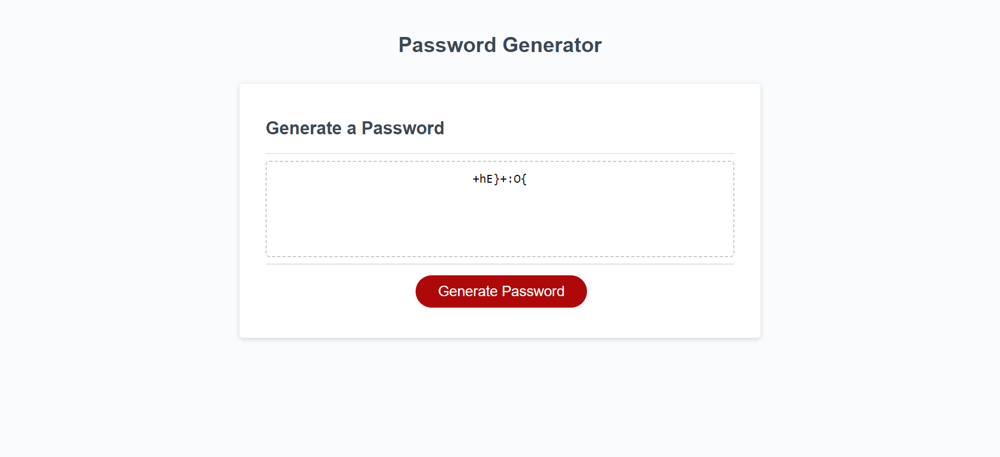

# Password-Generator

This application generates a password based on user's selected options. It prompts users to select the length of the password and the types of characters to include.

## Usage

1. Click the "Generate Password" button to start.
2. Respond to the series of prompts for password criteria:
   - **Length of password:** Choose a length between 8 and 128 characters.
   - **Character types:** Select at least one of the below:
     - Lowercase letters
     - Uppercase letters
     - Numeric characters
     - Special characters
3. Once all prompts are answered, the password will be generated.
4. The generated password will be displayed for the user.

## Validation

- The code validates each input to ensure the entered length is within the specified range (8-128 characters) and at least one character type is selected.

## Technologies Used

- HTML
- CSS
- JavaScript

## Getting Started

To view the portfolio locally:

1. Clone this repository using `git clone https://github.com/FolaBookie/Password-Generator.git`
2. Open the `index.html` file in a web browser.

## License

This project is licensed under the [MIT License](LICENSE).

